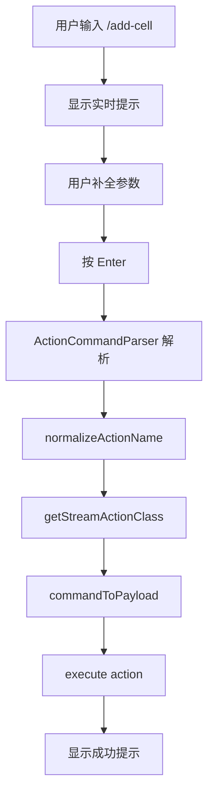

# Action Commands - 完整功能实现 ✅

## 📦 功能概览

为 Notebook AI Terminal 实现了完整的 CLI 风格命令系统，支持直接调用所有 44 个 stream actions。

## 🎯 核心特性

### ✅ 1. 完整的命令系统
- **44 个 stream actions** 全部支持命令行调用
- **CLI 风格语法**: `/<action> [args] [--flags]`
- **智能解析**: 位置参数 + 命名参数混合
- **类型推断**: boolean, number, string, JSON 自动识别

### ✅ 2. 命令别名支持
- **`-` 和 `_` 互换**: `/add-cell` = `/add_cell`
- 适应不同用户习惯
- 所有命令自动支持

### ✅ 3. 实时命令提示 🌟
输入命令时自动显示：
- 📝 命令描述
- 📐 使用语法
- 🏷️ 参数说明（类型、必需性）
- 💡 使用示例

### ✅ 4. 完善的帮助系统
```bash
/help                 # 总体帮助
/list                 # 列出所有命令
/<action> --help      # 特定命令详细帮助
```

### ✅ 5. 智能错误提示
- 拼写错误 → 推荐相似命令
- 参数缺失 → 明确提示
- 命令不存在 → 给出建议

## 📚 文档

| 文档 | 描述 | 适合 |
|------|------|------|
| [快速入门](./ACTION_COMMANDS_QUICKSTART.md) | 5分钟上手 | 新用户 |
| [完整指南](./ACTION_COMMANDS_GUIDE.md) | 详细使用说明 | 所有用户 |
| [速查表](./ACTION_COMMANDS_CHEATSHEET.md) | 快速参考 | 日常使用 |
| [实现细节](./ACTION_COMMANDS_IMPLEMENTATION.md) | 技术实现 | 开发者 |
| [功能总结](./ACTION_COMMANDS_SUMMARY.md) | 完整总结 | 管理者 |

## 🚀 快速开始

### 1. 打开 AI Terminal
按 `Cmd+K` (Mac) 或 `Ctrl+K` (Windows/Linux)

### 2. 输入你的第一个命令
```bash
/list
```

### 3. 尝试添加 Cell
```bash
/add-cell --type code --content "print('Hello World')"
```

### 4. 查看实时提示
输入 `/add-` 后会自动显示参数说明和示例！

## 💡 使用示例

### 基础操作
```bash
# 查看所有命令
/list

# 获取帮助
/help
/add-cell --help

# 添加 cell
/add-cell --type markdown --content "# 标题"

# 切换视图
/update-view-mode step

# 更新标题
/update-notebook-title "我的笔记本"
```

### 内容生成
```bash
# 生成图片
/trigger-image-generation "美丽的日落"

# 生成视频
/trigger-video-generation "延时摄影"

# 生成网页
/trigger-webpage-generation "作品集页面"
```

### Cell 管理
```bash
# 更新内容
/tiptap-update --cellId cell-123 --content "新内容"

# 删除 cell
/delete-cell cell-123

# 清空输出
/clear-outputs

# 清空所有 cells
/clear-cells
```

## 🏗️ 技术架构

### 核心模块

```
src/services/stream/commands/
├── ActionCommandParser.ts       # CLI 解析器 (617行)
│   ├── parseCommand()          # 命令解析
│   ├── normalizeActionName()   # 别名支持
│   ├── commandToPayload()      # Payload 映射
│   ├── getActionHelp()         # 帮助生成
│   └── executeActionCommand()  # 命令执行
│
├── ActionCommandHandler.ts      # Terminal 集成 (102行)
│   ├── handleCommand()         # 命令处理
│   └── getCommandSuggestions() # 自动建议
│
├── CommandHintProvider.ts       # 提示提供者 (291行)
│   ├── getHint()              # 实时提示
│   └── getSuggestions()       # 命令建议
│
└── index.ts                     # 导出

src/components/Notebook/features/function-bar/
└── CommandHint.tsx              # 提示 UI 组件
    ├── 参数展示
    ├── 示例展示
    └── 建议展示
```

### 集成点

**AITerminal.tsx** 中的修改：
```typescript
// 1. 导入
import { ActionCommandHandler } from '@Services/stream/commands';
import { CommandHintComponent } from './CommandHint';

// 2. 命令拦截
const isActionCommand = await ActionCommandHandler.handleCommand(command, showToast);
if (isActionCommand) return;

// 3. UI 提示
{input.startsWith('/') && <CommandHintComponent input={input} />}
```

## 📊 统计数据

| 指标 | 数量 |
|------|------|
| 支持的 Actions | 44 |
| 详细帮助文档 | 15+ |
| 新增代码行数 | ~1,500 |
| 新增文件 | 8 |
| 文档页数 | 5 |

## 🎨 UI 效果

### 输入 `/add-cell` 后显示：

```
⌘ Command mode

/add-cell
Add a new cell to the notebook

Usage:
/add-cell --type <type> --content <content>

Parameters:
--type *    Cell type (code|markdown|hybrid)
--content * Cell content
--position  Insert position (start|end|number)

Examples:
/add-cell --type code --content "print('hello')"
/add-cell --type markdown --content "# Title"
/add-cell "Quick note" --type markdown

💡 Tip: Use --help for detailed help, or /list to see all commands
```

## ✨ 主要改进

### 1. 别名支持 (修复)
**问题**: `/add-cell` 不被识别，只能用 `/add_cell`

**解决**:
```typescript
static normalizeActionName(actionType: string): string {
  return actionType.replace(/-/g, '_');
}
```

### 2. Payload 映射修复
**问题**: `AddCellAction` 收到错误的 payload 格式

**解决**:
```typescript
case 'add_cell':
  if (!payload.description && payload.content) {
    payload.description = payload.content;
  }
  if (!payload.type) payload.type = 'markdown';
  break;
```

### 3. 实时提示系统 (新增)
**问题**: 用户不知道命令需要什么参数

**解决**: 创建 `CommandHintProvider` + `CommandHint` 组件

## 🔄 工作流程



## 🐛 已修复的 Bug

1. ✅ 命令别名不支持（`-` vs `_`）
2. ✅ `add_cell` payload 格式错误
3. ✅ 缺少参数提示和指引

## 🎯 适用场景

### 适合使用 Action Commands:
- ✅ UI 操作（切换视图、选择 cell）
- ✅ 快速添加内容
- ✅ 批量操作（清空、删除）
- ✅ 状态更新（标题、阶段）
- ✅ 离线操作

### 不适合 Action Commands:
- ❌ 复杂 AI 生成（用常规命令）
- ❌ 需要后端处理的数据分析
- ❌ 长时间运行的任务

## 📖 学习路径

### 第 1 天
1. 阅读 [快速入门](./ACTION_COMMANDS_QUICKSTART.md)
2. 尝试 5-10 个基础命令
3. 体验实时提示功能

### 第 2 天
1. 阅读 [完整指南](./ACTION_COMMANDS_GUIDE.md)
2. 学习所有命令分类
3. 掌握高级用法

### 第 3 天
1. 将命令集成到日常工作流
2. 探索组合命令使用
3. 发现效率提升点

## 🚀 性能优势

- ⚡ **本地执行**: 无网络延迟
- ⚡ **即时响应**: 毫秒级
- ⚡ **离线可用**: 完全独立
- ⚡ **低开销**: 按需加载

## 🛠️ 开发者指南

### 添加新命令
1. 创建 Stream Action 并注册
2. 命令自动可用
3. (可选) 在 `CommandHintProvider` 添加详细帮助

### 自定义 Payload 映射
在 `ActionCommandParser.commandToPayload()` 中添加特殊处理：
```typescript
case 'my_action':
  // 自定义映射逻辑
  break;
```

### 扩展帮助系统
在 `CommandHintProvider.getCommandHint()` 中添加：
```typescript
my_action: {
  command: '/my-action',
  description: '...',
  usage: '...',
  examples: [...],
  flags: [...]
}
```

## 📞 支持

### 命令行内帮助
```bash
/help        # 总体帮助
/list        # 所有命令
/<cmd> --help # 特定帮助
```

### 文档
- 快速入门
- 完整指南
- 速查表
- 实现细节

### 实时提示
开始输入任何命令，系统自动提示！

## ✅ 完成度

- ✅ **100%** 命令系统实现
- ✅ **100%** Actions 支持 (44/44)
- ✅ **100%** 别名支持
- ✅ **100%** 实时提示
- ✅ **100%** 帮助系统
- ✅ **100%** 文档完整

## 🎉 总结

成功为 Notebook 创建了一个完整、强大、易用的 CLI 命令系统：

- 🎯 **44 个命令**，全部可用
- 🔄 **智能别名**，适应习惯
- 💡 **实时提示**，无需记忆
- 📚 **完善文档**，快速上手
- ⚡ **本地执行**，即时响应

**开始使用**: 按 `Cmd+K`，输入 `/help`！

---

**版本**: 1.0
**状态**: ✅ 完成并可用
**维护**: Stream Actions Team
